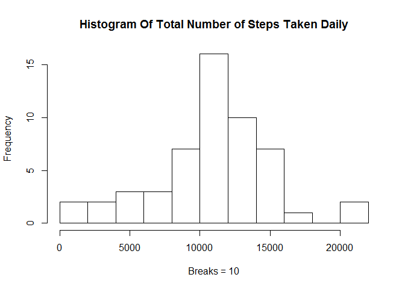
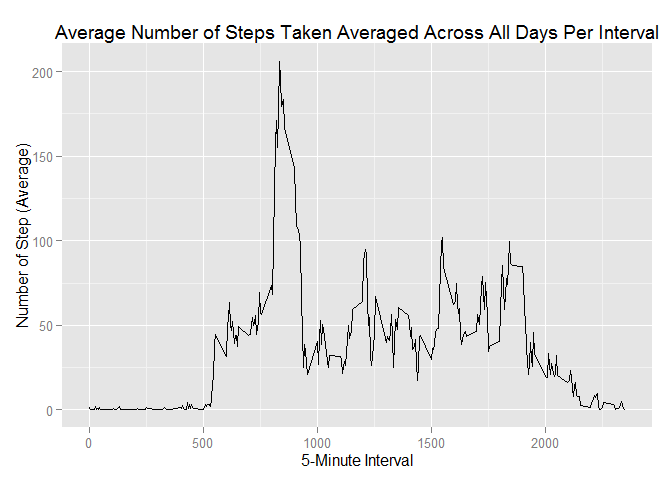
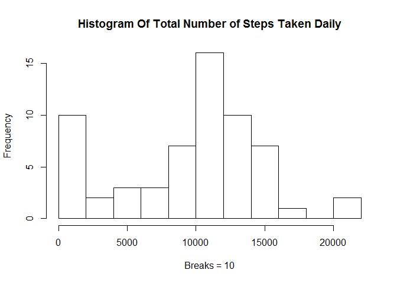

# Reproducible Research: Peer Assessment 1
Andres Mauricio Castro

## Introduction
This document describes all the process followed, in order to answer the questions described below, based on the dataset provided, so that, any other person can reproduce the entire process.

## Loading and preprocessing the data
Unzip the file containing the dataset, and read it.


```r
unzip("activity.zip")
data <- read.csv("activity.csv", header=T, quote="\"", sep=",")
```

Convert date to date data type

```r
data$date <- as.Date(data$date) 
```

## What is mean total number of steps taken per day?

1. Clean the missing values in the data.
2. Aggregate the number of steps by date.
3. Fix the columns names in the aggregated data set.
4. Plot the histogram, showing the frequence of the ranges; for this process, the number of breaks is 10.


```r
data.no.na <- na.omit(data) 
stepsByDay <- aggregate(data.no.na$steps, by =list(data.no.na$date), FUN = "sum")
colnames(stepsByDay) <- c("Date", "Steps")
hist(stepsByDay$Steps, 
     main="Histogram Of Total Number of Steps Taken Daily",
     breaks=10,
     xlab="Breaks = 10") 
```

 

Mean of steps:

```r
mean(stepsByDay$Steps); 
```

```
## [1] 10766.19
```
Median of steps:

```r
median(stepsByDay$Steps); 
```

```
## [1] 10765
```

## What is the average daily activity pattern?

1. Make a time series plot (i.e. type = "l") of the 5-minute interval (x-axis) and the average number of steps taken, averaged across all days (y-axis)

- Aggregate the mean number of steps per interval.
- Fix the columns names in the new dataset.
- Load the library required to plot the time series.
- Plot the times series.

```r
avgSteps <- aggregate(data.no.na$steps, by = list(as.numeric(as.character(data.no.na$interval))), FUN = "mean")
colnames(avgSteps) <- c("interval", "mean")
library(ggplot2)
qplot(x=interval, y=mean, data = avgSteps,  geom = "line",
      xlab="5-Minute Interval",
      ylab="Number of Step (Average)",
      main="Average Number of Steps Taken Averaged Across All Days Per Interval"
      )
```

 

2. Which 5-minute interval, on average across all the days in the dataset, contains the maximum number of steps?

```r
avgSteps[which.max(avgSteps$mean), ]
```

```
##     interval     mean
## 104      835 206.1698
```

## Imputing missing values

Note that there are a number of days/intervals where there are missing values (coded as NA). The presence of missing days may introduce bias into some calculations or summaries of the data.

1. Calculate and report the total number of missing values in the dataset (i.e. the total number of rows with NAs)


```r
number.na <- nrow(subset(data, is.na(data$steps)))
print(number.na)
```

```
## [1] 2304
```

2. Devise a strategy for filling in all of the missing values in the dataset. The strategy does not need to be sophisticated. For example, you could use the mean/median for that day, or the mean for that 5-minute interval, etc.
3. Create a new dataset that is equal to the original dataset but with the missing data filled in.

- To solve this problem, the strategy is:
    - Get a new data frame with the data of the steps, from the original data.
    - Apply a function to calculate the median of steps, for each interval. Then, apply the function floor, to
    get the largest integer not greater than the median of the steps in each interval.
    - Fill the missing values in the steps data frame, with the median calculated.
    - Fix the columns names in the new data frame.    


```r
stepValues <- data.frame(data$steps)
stepValues[is.na(stepValues),] <- floor(tapply(X=data$steps,INDEX=data$interval,FUN=median,na.rm=TRUE))
newDataFrame <- cbind(stepValues, data[,2:3])
colnames(newDataFrame) <- c("Steps", "Date", "Interval")
```


4. Make a histogram of the total number of steps taken each day and Calculate and report the mean and median total number of steps taken per day. Do these values differ from the estimates from the first part of the assignment? What is the impact of imputing missing data on the estimates of the total daily number of steps?


```r
stepsByDayNew <- aggregate(newDataFrame$Steps, by=list(newDataFrame$Date), FUN = "sum")
colnames(stepsByDayNew) <- c("Date", "Steps")
hist(stepsByDayNew$Steps, 
     main="Histogram Of Total Number of Steps Taken Daily",
     breaks=10,
     xlab="Breaks = 10")
```

 

**The new histogram shows an increase in the frequency of intervals containing 0 steps; the rest of breaks remains with the same frequency.**

Mean of steps in the new data set:

```r
mean(stepsByDayNew$Steps); 
```

```
## [1] 9503.869
```
Median of steps in the new data set:

```r
median(stepsByDayNew$Steps); 
```

```
## [1] 10395
```

*The strategy implemented to fill out the missing values, has increased the values of the mean and median of the steps; by exploring the new data set, after filling the missing values, new dates appear with information of the total steps, so, this may explain why the mean and the median increased!*

## Are there differences in activity patterns between weekdays and weekends?

For this part the weekdays() function may be of some help here. Use the dataset with the filled-in missing values for this part.

1. Create a new factor variable in the dataset with two levels - "weekday" and "weekend" indicating whether a given date is a weekday or weekend day.


```r
dayType <- data.frame(sapply(X=newDataFrame$Date, FUN=function(day) {
    if (weekdays(as.Date(day)) %in% c("Saturday", "Sunday")) {
        day <- "weekend"
    }
    else {
        day <- "weekday"
    } 
}))

newDataWithDayType <- cbind(newDataFrame, dayType)
colnames(newDataWithDayType) <- c("Steps", "Date", "Interval", "DayType")
```

2. Make a panel plot containing a time series plot (i.e. type = "l") of the 5-minute interval (x-axis) and the average number of steps taken, averaged across all weekday days or weekend days (y-axis). See the README file in the GitHub repository to see an example of what this plot should look like using simulated data.

- As per my native language, the locale configuration of my work environment is spanish, that is why you see 
sábado (saturday) and domingo (sunday), as names in the vector to create the new factor variable.
- Aggregate the data by interval and type of the day (weekend or weekday), calculating the mean.

```r
newDataFrame$DayType <- as.factor(ifelse(weekdays(newDataFrame$Date) %in% 
                                    c("sábado","domingo"),"weekend", "weekday"))
dayTypeIntervalSteps <- aggregate(
    data=newDataFrame,
    Steps ~ DayType + Interval,
    FUN=mean
)
```
- Create the plot for each type of day.

```r
library("lattice")
xyplot(
    type="l",
    data=dayTypeIntervalSteps,
    Steps ~ Interval | DayType,
    xlab="Interval",
    ylab="Number of steps",
    layout=c(1,2)
)
```

 
